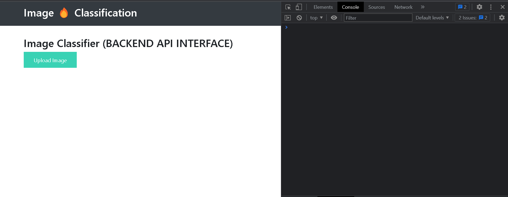
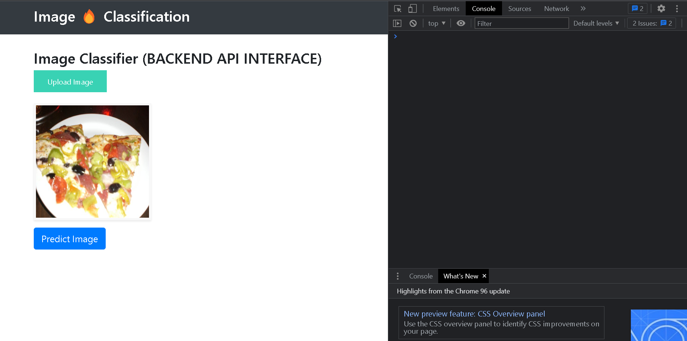
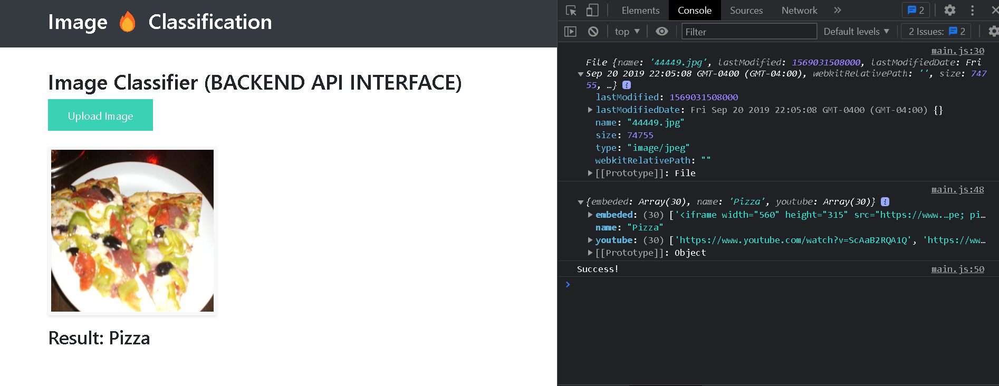
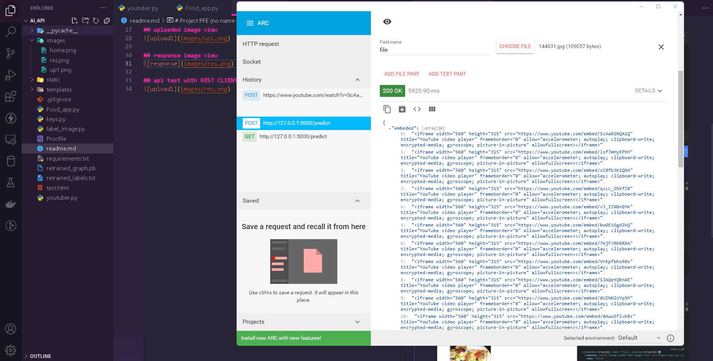

# Project PFE (no name yet for this project !!)
## _FLASK AI based API_

## INSTALLATION

- Clone this repo (ps: you may run into some problem with AI modules)

```sh
cd PFE_FLASK_API
pip install -r requirements.txt
```

to run the local servers...

```sh
python Food_app.py 
```


```sh
http://127.0.0.1:5000/
```
## PREVIEW
## main page view 

## uploaded image view


## response image view


## api test with REST CLIENT


# The app will not work for you unless you download these two files 
### These two used for the AI_MODEL and they are too have and you know tunis can not upload 100mb files it will take a long time😔

## link will provided soon i hope